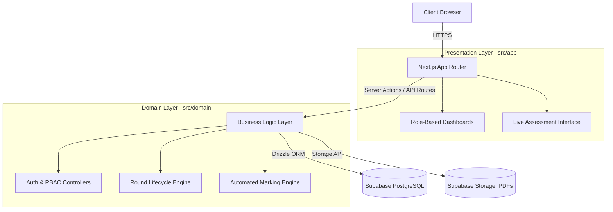

# System Design

## High-Level Architecture

## Architectural Strategy: Logically Decoupled Domain-Driven Design

While the application utilizes Next.js as a unified full-stack meta-framework, it strictly adheres to the non-monolithic architectural requirement through **Logical Decoupling and Domain-Driven Design (DDD)**.

Instead of a traditional physical split (e.g., separate frontend and backend repositories), our architecture enforces strict boundaries within the codebase:

- **Presentation Layer (`src/app` & `src/components`):** Exclusively responsible for serving the React user interface, client-side state, and visual layout.
- **Domain & Business Logic Layer (`src/domain` & `src/lib`):** Fully isolated from the UI components. This layer handles all validation, round execution rules, and automated grading computations.
- **Data Access Layer (Drizzle ORM):** Interacts with our Supabase PostgreSQL database.

The frontend components never query the database directly; they communicate strictly through Next.js Server Actions and Route Handlers, acting as an internal API bridge. This ensures a true separation of concerns, preventing the coupling of presentation code with backend business logic and fulfilling the rigorous constraints of the university rubric without sacrificing deployment efficiency.

## Security & Access Control (RBAC)

The system utilizes a strict Role-Based Access Control (RBAC) model managed via Supabase Auth.

- **Authentication:** Users authenticate via secure tokens.
- **Authorization:** Every internal API route and Server Action verifies the user's role (Admin, Organizer, Educator, or Student) before granting access to sensitive database mutations via Drizzle.

## Data & Storage Strategy

To maintain high performance, the system splits data persistence into two streams:

- **Relational Data:** Complex relationships are structured within Supabase PostgreSQL and queried safely via Drizzle ORM schemas.
- **Blob Storage:** Static assets, such as uploaded question paper PDFs, are handled by Supabase Storage buckets, keeping the primary database highly optimized.
