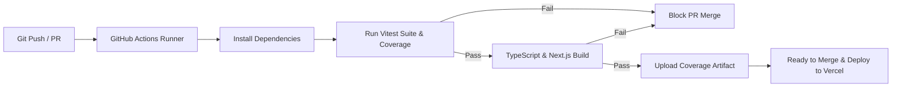

# Olympiad Portal: Comprehensive Testing Documentation

## Overview & Quality Assurance Philosophy
To ensure the high availability, security, and data integrity of the **Olympiad Portal**, we adhere to a multi-tiered, shift-left testing strategy based on the **Agile Testing Pyramid**. Our testing ecosystem combines isolated unit/domain tests, integration and API route tests, end-to-end (E2E) user flow verification, continuous integration gates, and formal User Acceptance Testing (UAT) feedback loops.

```
                  ▲
                 / \
                /   \     End-to-End (E2E) Tests (Playwright)
               / E2E \    - Full user journeys, Middleware auth, Cross-browser
              /-------\
             /  API &  \  API & Integration Tests (Vitest + Node Mocks)
            / Component \ - Route handlers, Drizzle ORM mocks, React forms
           /-------------\
          /  Unit & Logic \ Unit & Domain Tests (Vitest)
         /-----------------\ - Round state machines, Reminder automations
```

---

## 1. Automated Testing Architecture & Procedures

Our automated testing suite is separated into distinct layers to optimize execution speed, diagnostic precision, and full-spectrum confidence.

---

### Layer 1: Domain & Unit Logic Testing (Vitest)
* **Objective:** Validate critical core business logic and deterministic algorithms in complete isolation without network or database overhead.
* **Tooling:** **Vitest** (chosen for instant ESM execution, Turbopack alignment, and low runtime overhead).
* **Key Targets:**
  * **Round State Machine (`src/domain/rounds/round-state-machine.ts`):** Verifies deterministic phase transitions (`scheduled` $\rightarrow$ `open` $\rightarrow$ `closed` $\rightarrow$ `released`) derived from UTC timestamps, with `released` taking precedence once results are published.
  * **Automated Notification Engine (`src/domain/notifications/automation-engine.ts`):** Validates email queue filtering, idempotency constraints, and threshold detection for round opening/closing reminders.
  * **Public API Gates & Queries (`src/domain/public-api/`):** Verifies the anonymous read queries behind `/api/public/*` — deduplicated school directory, portal catalogue, round list, published scores, paper URLs — and the visibility gates layered on the round state machine: papers/questions become readable once a round has closed, marks only once results are released.
  * **School Directory Search (`src/lib/schools/`):** Verifies token-based fuzzy matching over the committed South African high-school snapshot (`searchHighSchools`) and the response mapping / error handling of the proxied hipolabs universities API (`searchUniversities`).
* **Characteristics:** 100% deterministic, executed in under 1 second.

---

### Layer 2: Component & UI Testing (Vitest + React Testing Library)
* **Objective:** Test React component behavior, user interactions, validation feedback, and DOM updates under simulated browser conditions (`jsdom`).
* **Tooling:** **Vitest**, `@testing-library/react`, `@testing-library/user-event`, and `jest-dom`.
* **Testing Standards:**
  * **User-Centric Queries:** Elements are selected exclusively via accessible roles and labels (e.g., `getByRole('button', { name: /apply/i })`, `getByLabelText(/email/i)`), enforcing WCAG accessibility standards.
  * **Server Action & Async Mocking:** Next.js Server Actions and Supabase authentication hooks are mocked with `vi.mock()` to isolate client rendering and optimistic updates from server execution.
* **Key Test Suites:**
  * `tests/components/OrganisationApplicationForm.test.tsx`: Validates form constraints, file upload size limits, validation state rendering, and submission dispatch.
  * `tests/components/SubmitButton.test.tsx`: Verifies loading spinners, pending states, and disabled button behavior during flight.
  * `tests/components/ui/ConfirmDialog.test.tsx`: Verifies the confirmation modal used for irreversible actions — focus management (safe cancel-first focus, Tab trap), Escape/backdrop dismissal, danger tone styling, and the busy lock that blocks every dismissal route while the confirmed action is running.
  * `tests/components/ui/PendingButton.test.tsx`: Verifies the double-click guard for one-shot actions outside forms — the button self-disables with a spinner while its `onClick` promise runs, recovers afterwards, and merges external pending flags.
  * `tests/components/student/ExamInterface.test.tsx`: Verifies exam rendering, answer autosave dispatch, and the finish-attempt flow — submission now requires confirmation through the modal dialog, which stays locked while the attempt is finalised.
  * `tests/components/schools/SchoolPicker.test.tsx`: Verifies the school-picker combobox — the high school/university type toggle, debounced suggestion fetching, keyboard navigation, and the selected-school state.

---

### Layer 3: API Route & Backend Integration Testing (Vitest)
* **Objective:** Ensure all Next.js App Router HTTP handlers (`/api/*`) handle request validation, role-based authorization, state transitions, and error states gracefully.
* **Mocking Patterns:**
  * **Drizzle ORM Mocking:** Database query builders and relational joins are mocked using chained fluent mock interfaces (supporting `.select().from().innerJoin().where().limit()`), ensuring DB interactions are verified without requiring live Postgres instances.
  * **Supabase Server Auth:** Mocking `createClient()` to simulate anonymous users, student members, educators, and platform admins.
  * **Domain Query Mocking (Public API):** The `/api/public/*` route tests mock the shared read functions in `src/domain/public-api/queries.ts`, verifying each route's parameter validation, visibility gating, and response envelope independently of SQL.
* **Key API Test Suites:**
  * `/api/health`: Validates system heartbeat and infrastructure readiness.
  * `/api/schools/suggest`: Tests school-picker suggestions — `q`/`type` validation, session auth, local high-school snapshot search, and 502 mapping when the universities API is unavailable.
  * `/api/student/sitting/start`: Tests sitting creation, timer initialization, and active sitting conflicts.
  * `/api/student/sitting/save`: Tests real-time answer persistence, payload integrity, and auto-save throttling.
  * `/api/student/sitting/submit`: Validates submission finalization, lock-out enforcement, and auto-marking trigger.
  * `/api/student/sitting/sync`: Tests offline/online answer synchronization and conflict resolution.
  * `/api/webhooks/round-scheduler`: Tests cron authentication tokens (`CRON_SECRET`) and bulk notification scheduling.
  * `/api/public/schools`, `/api/public/portals`, `/api/public/rounds`: Test the always-readable directories — response shapes, ISO date serialization, status exposure, and the wildcard CORS header with no session required.
  * `/api/public/results`: Tests the release gate (403 until the results are published), `round_id` validation (400/404), and the anonymous highest-first `{ score }` payload.
  * `/api/public/question-papers`, `/api/public/questions`: Test the post-closing gate (403 while a round is scheduled or open), paper URL mapping, and the full question bank with correct answers included.

---

### Layer 4: End-to-End (E2E) UI Testing (Playwright)
* **Objective:** Simulate real, unmocked end-user interactions in real browser engines to verify UI rendering, client-side routing, and security boundaries.
* **Tooling:** **Playwright Test Runner** across **Chromium**, **Firefox**, and **WebKit**.
* **Key Scenarios:**
  * **Authentication & Middleware Boundaries (`tests/e2e/signup.spec.ts`, `tests/e2e/organiser.spec.ts`):** Verifies that unauthorized users attempting to access protected routes (`/admin/*`, `/organiser/*`, `/educator/*`) are immediately redirected to `/login` with proper return URLs.
  * **Exam Sitting Flow:** Simulates a student opening an online test, navigating between questions, saving progress, and final submission under countdown constraints.
* **Artifact Generation:** Generates execution traces, step-by-step videos, and failure DOM screenshots in `/test-results` for rapid root-cause diagnosis.

---

### Test Execution Command Matrix

| Test Command | Scope | Environment | Purpose |
| :--- | :--- | :--- | :--- |
| `npm run test` | Unit, Component, API | Vitest (`jsdom` / Node) | Rapid local development with watch mode. |
| `npm run test:coverage` | Full Vitest Suite | Vitest + V8 Provider | Generates statement, branch, and function coverage reports. |
| `npm run test:e2e` | End-to-End User Flows | Playwright (Headless Browsers) | Validates critical paths and middleware security. |
| `npm run test:e2e:ui` | End-to-End Debugging | Playwright UI Mode | Interactive step-through of browser tests. |
| `npm run build` | Full Project Compilation | Next.js / TypeScript | Production build validation and static type-checking. |

---

## 2. Testing Policy & Quality Gates

To maintain strict software quality throughout the project lifecycle, the team adheres to the following formal engineering policies:

### 1. Code Coverage Target
* **Requirement:** A minimum of **70% statement and line coverage** is required across `src/components`, `src/domain`, `src/app/api`, and `src/lib`.
* **Enforcement:** Code coverage is monitored via the automated V8 coverage reporter during CI test runs.

### 2. CI/CD Integration & PR Quality Gates
* **Continuous Integration:** Every push and Pull Request triggers our GitHub Actions pipeline (`.github/workflows/ci.yml`).
* **Blocking Gates:** A Pull Request **cannot be merged into `main`** unless:
  1. `npm run test:coverage` completes with **0 failures**.
  2. Next.js production build (`npm run build`) type-checks with **0 TypeScript errors**.
* **Artifact Archiving:** Test coverage reports are automatically zipped and uploaded to GitHub Actions artifacts for auditable test governance.



### 3. Test-Driven Development (TDD) & Regression Mandate
* **Feature Addition:** Any new business module (e.g., Question Paper Builder, Auto-Marker) must be accompanied by corresponding unit tests before PR review.
* **Defect Resolution:** When fixing a reported bug, developers must first author a **failing regression test** that reproduces the bug, verify the test fails, and then commit the code fix that turns the test green.

### 4. Deterministic Mocking Standard
* Tests must never depend on external network state, live third-party services, or persistent remote databases.
* All external side effects (e.g., Resend/SMTP email delivery, Supabase Auth tokens, S3/R2 storage uploads) must be mocked using predictable fixtures to prevent test flakiness.

---

## 3. Formal User Feedback & Acceptance Testing (UAT)

In accordance with Agile Scrum principles, our quality assurance process extends beyond automated suites to include structured human-in-the-loop validation.

```
┌─────────────────┐       ┌─────────────────┐       ┌─────────────────┐       ┌─────────────────┐
│ 1. Sprint MVP   │ ────> │ 2. Structured   │ ────> │ 3. Triaging &   │ ────> │ 4. Backlog      │
│ Vercel Staging  │       │ Survey & Metrics│       │ Sprint Retro    │       │ Implementation  │
└─────────────────┘       └─────────────────┘       └─────────────────┘       └─────────────────┘
```

### The UAT Lifecycle

#### Step 1: Distribution & Staging Environment
* At the completion of each Sprint cycle, a release candidate is deployed to **Vercel Staging**.
* Preview access is distributed to selected peer testers representing four core user personas:
  * **Platform Admin:** System management, approvals, school indexing.
  * **Organiser:** Portal configuration, round scheduling, question paper upload.
  * **Educator:** Student roster registration, bulk entry management, score review.
  * **Student (Entrant):** Test taking, countdown timer management, results viewing.

#### Step 2: Formal Metric Collection
Testers complete structured user journeys followed by an evaluation survey capturing both quantitative and qualitative data:
* **Quantitative Usability Metrics:**
  * **Task Completion Rate (TCR):** Percentage of users who complete assigned critical flows without assistance.
  * **System Usability Scale (SUS):** Standardized 10-item usability survey targeting a minimum composite score of **75/100**.
  * **Single Ease Question (SEQ):** 1–7 scale rating task difficulty immediately following key flows (e.g., registration).
* **Qualitative Critique:**
  * Specific fields capturing navigation friction, confusing terminology, and UI responsiveness.

#### Step 3: Triaging & Retrospective Evaluation
* Feedback is reviewed during the **Sprint Retrospective**.
* Issues are categorized into four severity tiers:
  * `Blocker`: Critical security or flow impediments (fixed immediately).
  * `Major`: Confusing UX or multi-step friction (added to next Sprint Backlog).
  * `Minor`: Styling irregularities or non-critical layout shifts.
  * `Enhancement`: Feature suggestions and cosmetic polish.

#### Step 4: Iterative Engineering Integration
* Validated feedback items are converted into actionable **Gitea Issues** with linked test cases.
* **Example Case Study:** During Sprint 1 UAT, qualitative feedback revealed that our original dashboard felt *"too generic and visually plain"*. This prompted a dedicated UI pivot in Sprint 2, introducing tailored role-based dashboards, improved contrast cards, dynamic state badges, and an elevated glassmorphism design system.

---

## 4. Test Suite Inventory

| Suite Location | Scope / Target | Focus Area |
| :--- | :--- | :--- |
| `tests/domain/round-state-machine.test.ts` | Unit | Time-based phase calculation & state transitions |
| `tests/domain/automation-engine.test.ts` | Unit | Notification queue logic & idempotency |
| `tests/domain/public-api-queries.test.ts` | Unit | Public read queries: key mapping, portal grouping, numeric coercion & file-URL filtering |
| `tests/domain/public-api-access.test.ts` | Unit | Visibility gates: closed/released availability for papers and published marks |
| `tests/lib/high-schools.test.ts` | Unit | Token-based fuzzy search over the SA high-school snapshot |
| `tests/lib/universities.test.ts` | Unit | Hipolabs universities proxy mapping & failure handling |
| `tests/components/OrganisationApplicationForm.test.tsx` | Component | Form validation, user input, server action dispatch |
| `tests/components/SubmitButton.test.tsx` | Component | Pending state, button disabling, loading spinners |
| `tests/components/ui/ConfirmDialog.test.tsx` | Component | Confirmation modal: focus trap, Escape/backdrop cancel & busy dismissal lock |
| `tests/components/ui/PendingButton.test.tsx` | Component | Double-click guard, async pending state & external pending flag |
| `tests/components/student/ExamInterface.test.tsx` | Component | Exam rendering, answer autosave & finish-attempt confirmation flow |
| `tests/components/schools/SchoolPicker.test.tsx` | Component | Combobox type toggle, debounced fetching & keyboard navigation |
| `tests/api/health.test.ts` | API Integration | System uptime & endpoint availability |
| `tests/api/schools.suggest.test.ts` | API Integration | School picker suggestions, auth, validation & proxy 502 mapping |
| `tests/api/public/schools.test.ts` | API Integration | Public school directory: response shape, no-auth & CORS header |
| `tests/api/public/portals.test.ts` | API Integration | Portal catalogue: status/schools exposure & ISO date serialization |
| `tests/api/public/rounds.test.ts` | API Integration | Round list: portal nesting, threshold coercion & CORS |
| `tests/api/public/results.test.ts` | API Integration | Results release gate (403), 400/404 handling & anonymous scores |
| `tests/api/public/question-papers.test.ts` | API Integration | Post-closing gate & paper `public_url` mapping |
| `tests/api/public/questions.test.ts` | API Integration | Post-closing gate & full question bank with correct answers |
| `tests/app/send-invitations.test.ts` | Server Action | Picked-school parsing, find-or-create of school rows & invite emails |
| `tests/api/student/sitting.start.test.ts` | API Integration | Exam session initiation & uniqueness constraints |
| `tests/api/student/sitting.save.test.ts` | API Integration | Answer draft persistence & payload checks |
| `tests/api/student/sitting.submit.test.ts` | API Integration | Exam completion & submission immutability |
| `tests/api/student/sitting.sync.test.ts` | API Integration | Offline/online answer synchronization |
| `tests/e2e/signup.spec.ts` | Playwright E2E | User registration flow & client-side routing |
| `tests/e2e/organiser.spec.ts` | Playwright E2E | Protected route access & middleware redirect rules |