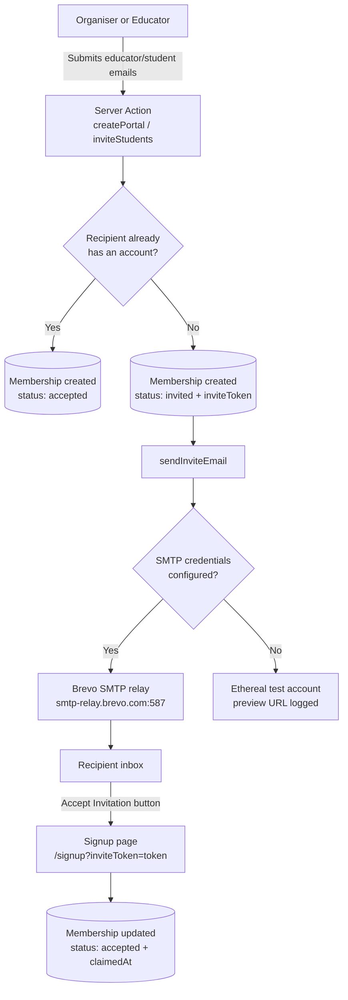

# Email (SMTP)

## Overview

The Olympiad Portal sends transactional email over SMTP, relayed through **Brevo** (formerly Sendinblue). Brevo was selected because its free tier provides 300 emails per day, which comfortably covers our invitation-driven workflows, and it exposes a standard SMTP relay that works with [Nodemailer](https://nodemailer.com/) without any proprietary SDK.

The entire email pipeline is centralized in a single module, `src/lib/email/index.ts`. Application code never talks to SMTP directly: Server Actions call the module's `sendInviteEmail()` helper, and the module decides at runtime whether to deliver through Brevo or fall back to a disposable test account for development.

## How It Works

### Transporter resolution: Brevo or Ethereal

On the first send, the module builds a Nodemailer transporter and caches it for the lifetime of the server process, so a new SMTP connection is not opened for every email.

- **SMTP credentials present** (`SMTP_HOST`, `SMTP_USER` and `SMTP_PASS` all set): the transporter points at Brevo's relay (`smtp-relay.brevo.com:587`) and real emails are delivered. Port 465 connects with implicit TLS; all other ports (including the default 587) upgrade the connection via STARTTLS. Setting `SMTP_SECURE=true` forces implicit TLS regardless of port.
- **Any credential missing**: the module creates an [Ethereal](https://ethereal.email/) test account — a fake SMTP service that captures messages and returns a preview URL instead of delivering them. This keeps local development and demos fully functional without live keys; the console logs the account details and a preview link for every email sent.

### The invitation lifecycle

Invite emails are the only email type currently implemented, and they drive account claiming for both educators and students:



Step by step:

1. An organiser creates a portal with educator emails (`createPortal` in `src/app/organiser/actions.ts`), or an educator adds student emails (`inviteStudents` in `src/app/educator/actions.ts`).
2. For each email address, the Server Action checks whether a user account already exists:
   - **Existing account:** the membership is inserted immediately with status `accepted` — no email is sent.
   - **No account:** a membership is inserted with status `invited` and a randomly generated UUID `inviteToken`, and the address is queued for an invite email.
3. Once all database writes have completed (the organiser flow only sends after the Drizzle transaction commits, so a failed email can never leave half-written data), `sendInviteEmail()` is called once per invite. It renders a styled HTML email from `EMAIL_FROM` with the subject `You've been invited to join <portalName>` and an **Accept Invitation** button linking to `${NEXT_PUBLIC_BASE_URL}/signup?inviteToken=<token>`.
4. The recipient signs up through that link. The `signup` Server Action (`src/app/auth/actions.ts`) looks up the membership by token, attaches the new user to it (`userId`, `status: 'accepted'`, `claimedAt`), and redirects them straight to their dashboard.

### Error handling

Email delivery is intentionally non-blocking: each invite send is wrapped in its own `try/catch`, so one failed recipient is logged server-side and never aborts the remaining inserts or invites. Emails are currently sent inline within the Server Actions — there is no queue or retry mechanism yet, which is a known limitation to revisit as email volume grows.

## Environment Variables

All email configuration lives in `.env.local` (never commit real keys):

| Variable               | Required    | Description                                                                                                                                                                                                       |
| ---------------------- | ----------- | ----------------------------------------------------------------------------------------------------------------------------------------------------------------------------------------------------------------- |
| `SMTP_HOST`            | Yes         | SMTP relay hostname. For Brevo: `smtp-relay.brevo.com`.                                                                                                                                                           |
| `SMTP_PORT`            | No          | Defaults to `587` (STARTTLS). Use `465` for implicit TLS.                                                                                                                                                         |
| `SMTP_USER`            | Yes         | The SMTP **Login** value from the Brevo dashboard, e.g. `xxxxxxxx@smtp-brevo.com`.                                                                                                                                |
| `SMTP_PASS`            | Yes         | A generated Brevo **SMTP key** (`xsmtpsib-...`) — not your Brevo account password.                                                                                                                                |
| `SMTP_SECURE`          | No          | Set to `true` to force implicit TLS on any port.                                                                                                                                                                  |
| `EMAIL_FROM`           | Recommended | Sender address shown to recipients. Must be your Brevo account email or a sender/domain verified in Brevo, otherwise sends are rejected. A display name is supported, e.g. `"Olympiad Portal" <you@example.com>`. |
| `NEXT_PUBLIC_BASE_URL` | Recommended | Absolute base URL of the deployment, used to build the invitation links (trailing slashes are stripped automatically).                                                                                            |

:::note

"Required" here means required for live delivery. Without `SMTP_HOST` / `SMTP_USER` / `SMTP_PASS` the app still works — invites simply fall back to Ethereal and are not actually sent.

:::

## Brevo Setup Guide

1. Create a free account at [brevo.com](https://www.brevo.com) (free tier: 300 emails/day).
2. Open the SMTP & API settings page: [app.brevo.com/settings/keys/smtp](https://app.brevo.com/settings/keys/smtp).
3. Copy the **Login** value (it looks like `xxxxxxxx@smtp-brevo.com`) into `SMTP_USER`.
4. Click **Generate a new SMTP key** and paste it into `SMTP_PASS`.
5. Set `EMAIL_FROM` to your Brevo account email, or verify a custom sender/domain in Brevo and use that address.
6. Add the values to `.env.local` and restart the dev server.

```bash
# Email sending — Brevo SMTP (placeholders, do not commit real keys)
SMTP_HOST=smtp-relay.brevo.com
SMTP_PORT=587
SMTP_USER=xxxxxxxx@smtp-brevo.com
SMTP_PASS=xsmtpsib-xxxxxxxxxxxxxxxxxxxxxxxx
EMAIL_FROM="Olympiad Portal" <you@example.com>
NEXT_PUBLIC_BASE_URL=http://localhost:3000
```

## Gotchas

- **Unverified senders are rejected.** If `EMAIL_FROM` is missing, the module logs a warning and falls back to a placeholder address (`noreply@olympiad-portal.local`) that Brevo will refuse.
- **Daily quota.** The Brevo free tier allows 300 emails per day; a large portal-creation batch can approach this limit.
- **Ethereal is silent.** While credentials are absent, everything appears to work — watch the server console for the `Invite email preview:` URL to inspect the captured messages.
- **Emails are fire-and-log.** Failures are logged, not surfaced to the user, and are not retried automatically.
